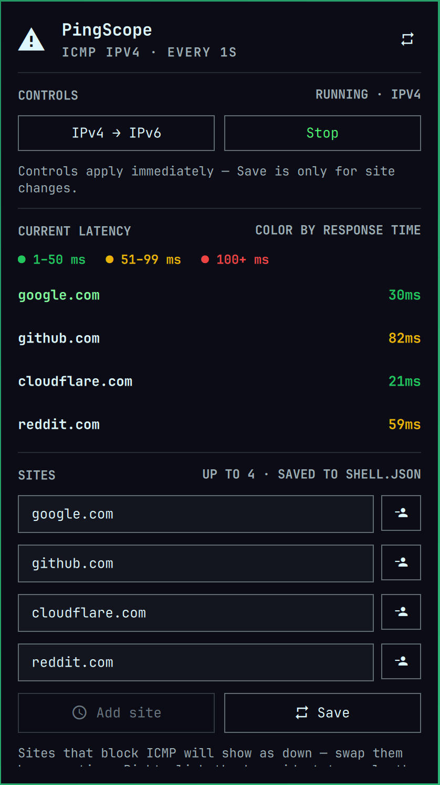

# PingScope

PingScope is an Omarchy bar widget that monitors current ICMP latency for up
to four hosts. It keeps every configured site's latest reading visible in a
compact panel and highlights response time at a glance.

> **This fork** (stefanoconiglio/omarchy-pingscope) has no panel. The bar shows
> the site's latency inside a soft outline: the bar's colour when fast, orange
> from 50 ms, red from 100 ms and when down. Behind it, `ping <site> -i 1` runs
> all the time at your own shell prompt, in a tmux session of its own. Hovering
> the bar face shows that session's screen, live; a click opens a terminal
> attached to it in the same place, where Ctrl+C stops the ping and Up brings
> the command back to edit. The terminal closes when it loses focus; the
> session goes on. Settings are edited in `shell.json`. The rest of this README
> is upstream's, adjusted where the panel is gone; the preview shows upstream's
> panel.



## Features

- Shows a continuous `ping` to the host when the bar face is hovered.
- Colors readings green from 1–50 ms, yellow from 51–99 ms, and red from
  100 ms upward.
- Marks unreachable hosts in red.
- Probes over IPv4 or IPv6, and can be stopped, from its settings.
- Opens a terminal on that `ping` with a click, to stop it or type another command.
- Supports up to four hostnames and follows the active Omarchy theme.

## Requirements

- Omarchy with Quickshell plugin support.
- The system `ping` command, normally provided by `iputils` on Omarchy.
- `tmux`, for the ping session.

PingScope has no external service, account, API key, or downloaded dependency.

## Installation

Install and enable PingScope from its public GitHub repository:

```bash
omarchy plugin add https://github.com/sierrab1989/omarchy-pingscope.git --enable
```

Choose the right bar section if Omarchy asks for placement. The manifest also
declares the right section as its default.

## Usage

- **Hover** over the bar widget to see the ping session's screen: the shell
  running `ping <host> -i 1`, updated twice a second.
- **Left-click** the bar widget to open a terminal attached to that session, in
  the same place. Ctrl+C stops the ping; Up recalls the command to change and
  rerun it. The terminal closes when it loses focus, or on another click; the
  session keeps running (`tmux -L pingscope attach` reaches it from anywhere).
- The face and the session use the first host of `sites` (or `focusedSite`).

## Latency colors

| Displayed latency | Color |
|-------------------|-------|
| 1–50 ms | Green |
| 51–99 ms | Yellow |
| 100 ms or higher | Red |
| Unreachable | Red |

## Configuration

Edit the widget's entry in `~/.config/omarchy/shell.json`; the shell picks
the change up on save:

```json
{
  "id": "pingscope.latency",
  "sites": ["google.com", "github.com", "cloudflare.com", "reddit.com"],
  "focusedSite": 0,
  "closedRefreshSec": 1,
  "ipVersion": 4,
  "timeoutSec": 10,
  "running": true
}
```

| Key | Meaning | Default |
|-----|---------|---------|
| `sites` | Hostnames to ping; duplicates are removed | Four common sites |
| `focusedSite` | Site displayed in the compact bar widget | `0` |
| `closedRefreshSec` | Probe interval in seconds | `1` |
| `ipVersion` | Ping protocol: `4` or `6` | `4` |
| `timeoutSec` | How long a probe waits for its reply before the site counts as down; a slower reply shows as its latency | `10` |
| `running` | Whether probes are active | `true` |

## Updates

Update a Git-managed installation with:

```bash
omarchy plugin update pingscope.latency
```

## Removal

Remove PingScope with:

```bash
omarchy plugin remove pingscope.latency
```

Removing the plugin removes its installed source and bar entry. It does not
remove the system `ping` command or change network configuration.

## Privacy and security

PingScope runs `ping -4` or `ping -6` once per configured host at the selected
interval, and keeps one `ping <host> -i 1` running in a tmux session (server
`pingscope`) until it is stopped there. ICMP traffic is sent only to those
hosts. The plugin does not use
`sudo`, read credentials, collect telemetry, download code, or send results to
an external service. Hostnames and widget settings are stored by Omarchy in
`~/.config/omarchy/shell.json`.

Omarchy community plugins run with the current user's permissions. Review the
source before enabling any third-party plugin.

## Development

Validate a checkout before testing or publishing:

```bash
omarchy plugin validate .
```

The plugin files are:

| File | Purpose |
|------|---------|
| `manifest.json` | Omarchy plugin manifest for `pingscope.latency` |
| `Panel.qml` | Bar face, hover view, attached terminal, and IPC |
| `ping-terminal.sh` | Starts the ping session; opens a terminal attached to it |
| `tmux.conf` | The ping session's tmux server: no status line, mouse scrolling |
| `Attention.qml`, `Attention.js` | The face's colours, readable on every theme's bar |
| `SitePinger.qml` | Repeating per-host `ping` process |
| `PingModel.js` | Host normalization, ping parsing, and status ranges |

## License

PingScope is available under the [MIT License](LICENSE).
